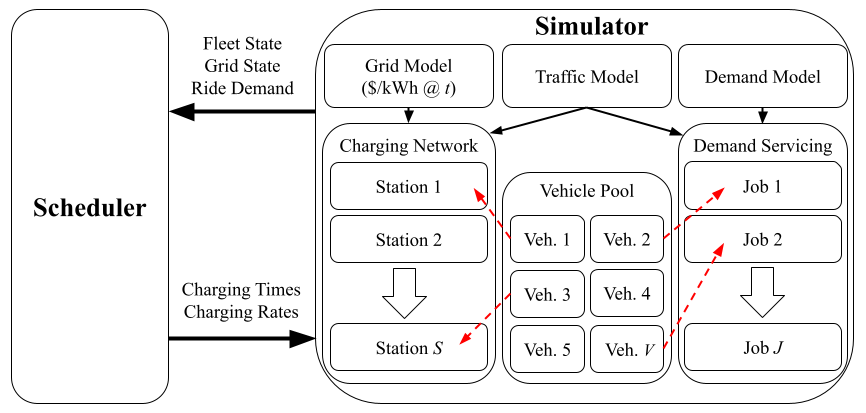

# Electric Taxi Fleet Simulator

Electric vehicles pose several unique challenges with respect to fleet operations:
1. Batteries degrade over time, leading to reduced capacity to service demand and premature vehicle retirement
2. Uncoordinated charging has the potential to place undue stress on the grid, leading to failure of critical infrastructure, or high costs for a fleet/grid operator
3. The fleet operator still needs to maximize profit with respect to varying grid and demand conditions.
This simulator attempts to address these problems and more by simulating a taxi fleet over a long time horizon.
For details please refer to [this paper](https://arxiv.org/pdf/2510.19293).
If you use this simulator in your research, please cite as:
```
@inproceedings{yuhas2025managing,
  author={Michael Yuhas and Rajesh K. Ahir and Vixell Tanjaya Hartono and Muhammad Dzaki Dwi Putranto and Arvind Easwaran and Suhono Harso Supangkat},
  booktitle={2025 IEEE Innovative Smart Grid Technologies - Asia (ISGT-Asia)}, 
  title={Managing Charging Induced Grid Stress and Battery Degradation in Electric Taxi Fleets}, 
  year={2025},
}
```

## Quick Start

### Installation
```
pip install git+https://github.com/sccicitb/simulasi-pengisian-taksi-listrik.git
```
### Data Preparation
This simulator uses real-world taxi data to simulate demand in a region.
Right now two datasets are supported: New York City and Chicago.
You will need to download the csv files for the years you want to simulate from those websites separately.

To convert the data into a format accepted by the simulator run the following for the Chicago dataset:
```
python -m scripts.chicago_cab_data_prep --raw-data <Paths to downloaded CSVs>
```
And the following for the New York dataset:


## Architecture

The simulator consists of 6 main models:
1. **Traffic** - determines how long and how much energy is required for vehicles to move between locations
2. **Demand** - determines when and where ride demand occurs
3. **Grid** - determines localized grid constraints at charging stations
4. **Charging Network** - locations and capabilities of charging stations
5. **Vehicle** - vehicle efficiency, capability, and battery SoC / SoH over time
6. **Job** - the status and outcome of each ride demand
The state of each of these models determines the simulator state.
A scheduler can then use this state to determine what actions a vehicle should take.
The simulator is tick-based, meaning the state evolves over time based on the scheduler's actions and the internal states of each model.

## Contributing
Pull requests are welcome.
Please run the unit tests before making a pull request.
We are happy to consider all contributions, however, we are especially interested in completing the following:
* Proper Python packaging
* Adding "Readthedocs" style documentation
* Charging station / vehicle downtime modelling
* Driver / passenger behavior modelling
* Modelling dynamic grid condtions
* Modelling calendar aging 
* Vehicle-to-job assignment
* Additional scheduling models
